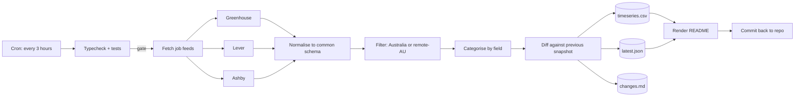

# Australia Tech Pulse

An open, auto-updating snapshot of the Australian technology job market, with a
focus on roles an Adelaide-based engineer can take: jobs located in Adelaide or
open to remote applicants across Australia. The data is collected automatically
from public company hiring feeds several times a day and committed straight back
to this repository, so the numbers below track the live market without anyone
touching a keyboard.

**Last updated:** Tue, 11 Aug 2026, 07:22 am (Adelaide time) · run #60

## Right now

| Metric | Count |
| --- | --- |
| Open tech roles tracked | **29** |
| Located in Adelaide or South Australia | **0** |
| Open to remote within Australia | **0** |
| Companies hiring | **6** |

## By field

```
Data Engineering            2  ######......................
Machine Learning & AI       4  ###########.................
Cyber Security              2  ######......................
Software Engineering       10  ############################
Cloud & DevOps              4  ###########.................
Other Tech                  7  ####################........
```

## Trend

Open roles tracked across the last 60 runs:

<svg width="720" height="120" viewBox="0 0 720 120" xmlns="http://www.w3.org/2000/svg" role="img" aria-label="Open roles over time">
  <polyline fill="none" stroke="#22d3ee" stroke-width="2" points="8.0,70.4 19.9,70.4 31.9,70.4 43.8,70.4 55.7,49.6 67.7,28.8 79.6,28.8 91.5,28.8 103.5,28.8 115.4,28.8 127.3,8.0 139.3,8.0 151.2,8.0 163.1,28.8 175.1,28.8 187.0,28.8 198.9,49.6 210.8,70.4 222.8,70.4 234.7,70.4 246.6,70.4 258.6,70.4 270.5,70.4 282.4,91.2 294.4,91.2 306.3,70.4 318.2,70.4 330.2,70.4 342.1,70.4 354.0,70.4 366.0,70.4 377.9,70.4 389.8,70.4 401.8,70.4 413.7,70.4 425.6,70.4 437.6,70.4 449.5,70.4 461.4,70.4 473.4,70.4 485.3,70.4 497.2,70.4 509.2,70.4 521.1,70.4 533.0,70.4 544.9,70.4 556.9,70.4 568.8,70.4 580.7,70.4 592.7,70.4 604.6,70.4 616.5,91.2 628.5,91.2 640.4,91.2 652.3,91.2 664.3,91.2 676.2,112.0 688.1,112.0 700.1,112.0 712.0,112.0" />
  <circle cx="712.0" cy="112.0" r="3.5" fill="#22d3ee" />
</svg>

## Companies hiring the most

| # | Company | Open tech roles |
| --- | --- | --- |
| 1 | Easygo | 11 |
| 2 | Relevance AI | 6 |
| 3 | The Trade Desk | 5 |
| 4 | Culture Amp | 3 |
| 5 | Deputy | 3 |
| 6 | Immutable | 1 |

## Newest roles

| Role | Company | Location | Field |
| --- | --- | --- | --- |
| [Staff AI Application Security Engineer](https://jobs.ashbyhq.com/relevanceai/800c3d0b-865a-4169-b792-e3127b5a2c30) | Relevance AI | Sydney, Australia | Cyber Security |
| [Staff AI Platform Engineer](https://jobs.ashbyhq.com/relevanceai/cfc7da1e-7e0a-488a-a39c-26536baeefba) | Relevance AI | Sydney, Australia | Cloud & DevOps |
| [Engineering Manager, AI](https://jobs.ashbyhq.com/relevanceai/4fca67c5-d41e-4bef-946d-9cc0a74aaf2c) | Relevance AI | Sydney, Australia | Other Tech |
| [Senior AI Product Engineer](https://jobs.ashbyhq.com/relevanceai/ddc1b147-ecfc-4389-a1aa-fbdfb11a2cb6) | Relevance AI | Sydney, Australia | Other Tech |
| [Staff AI Product Engineer](https://jobs.ashbyhq.com/relevanceai/48ce82ea-0772-4e51-a979-eb56c32ca019) | Relevance AI | Sydney, Australia | Other Tech |
| [Senior Frontend Engineer - KICK Video/Ads](https://job-boards.greenhouse.io/easygo/jobs/5202608007) | Easygo | Melbourne, Australia | Software Engineering |
| [Senior Platform Engineer](https://jobs.lever.co/immutable/fcd9fcb4-e568-4a40-a67e-fd57442171de) | Immutable | Sydney | Data Engineering |
| [Senior Data Analyst - Kick (Modelling)](https://job-boards.greenhouse.io/easygo/jobs/5097649007) | Easygo | Melbourne, Australia | Data Engineering |
| [Technical Support Engineer - Tier 3](https://jobs.lever.co/deputy/f22f8969-4a6d-44cc-95fb-a2f205264a10) | Deputy | Sydney | Other Tech |
| [Senior Backend Engineer - Engine](https://job-boards.greenhouse.io/easygo/jobs/5191644007) | Easygo | Melbourne, Australia | Cloud & DevOps |
| [Software Engineering Manager](https://job-boards.greenhouse.io/easygo/jobs/5152558007) | Easygo | Melbourne | Other Tech |
| [Sr Incident Response Engineer](https://job-boards.greenhouse.io/thetradedesk/jobs/5189449007) | The Trade Desk | Sydney | Cyber Security |
| [Lead DevOps Engineer](https://jobs.lever.co/deputy/ef5bcbd3-3b65-4c5e-8350-4af852113be9) | Deputy | Sydney | Cloud & DevOps |
| [Senior Frontend Engineer, Design Systems](https://jobs.lever.co/deputy/41506091-6b34-4bac-977c-c0ae7d342e1f) | Deputy | Sydney | Software Engineering |
| [Senior Software Engineer - Engagement](https://job-boards.greenhouse.io/easygo/jobs/5123541007) | Easygo | Melbourne, Australia | Software Engineering |

## How it works

A scheduled GitHub Action pulls the public job feeds (Greenhouse, Lever, Ashby)
of a watchlist of Australian technology employers, keeps the roles located in
Australia or open to remote applicants, sorts them into fields, and writes three
data files:

- [`data/timeseries.csv`](data/timeseries.csv) one row per run, the headline counts over time
- [`data/latest.json`](data/latest.json) every open role in the current snapshot
- [`data/changes.md`](data/changes.md) a running log of roles that appeared or closed

No API keys, no scraping of private pages, no personal data. Everything is
sourced from feeds the companies publish for their own careers pages.

## Pipeline



Design notes, for anyone reading this as an engineering sample:

- **Every run is gated by CI.** `npm run typecheck` and `npm test` both have to
  pass before any collection happens, so a broken parser can never write a bad
  measurement into the history.
- **Runs are serialised.** A concurrency group prevents two scheduled runs from
  overlapping and double-committing the same window.
- **The history is append-only.** Each run adds one row to the time series rather
  than rewriting it, so the trend line is a real record and not a recomputation.
- **The README is generated, not hand-edited.** This file is rendered from
  `src/dashboard.ts` on every run, which is why the numbers above are never stale.
- **Failure is visible.** A ten-minute timeout and a scoped write permission mean
  a hung or misbehaving run fails loudly instead of silently skipping.

Built with TypeScript on Node 20, no runtime dependencies beyond the standard
toolchain, and no database: the repository itself is the datastore.

## Run it yourself

```bash
git clone https://github.com/Vikrant892/au-tech-pulse.git
cd au-tech-pulse
npm ci
npm run typecheck && npm test
npm run pulse          # writes data/ and regenerates this README
```

## Why this exists

Job boards show you a slice of a single day. A time series shows you where the
market is moving: which fields are growing, which companies are scaling, and how
much of the work is open to remote applicants. South Australian employers mostly
hire through systems without public feeds, so the local-only count runs lean and
the real opportunity for an Adelaide engineer is the remote-Australia market.
This repository keeps that record in the open.

## Licence

MIT. The collected data is public information; the code is free to reuse.
