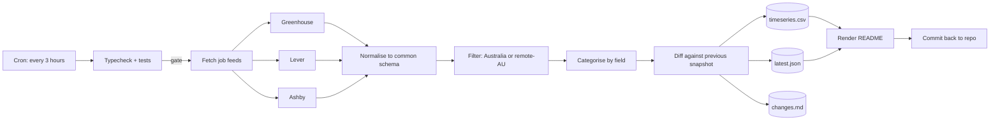

# Australia Tech Pulse

An open, auto-updating snapshot of the Australian technology job market, with a
focus on roles an Adelaide-based engineer can take: jobs located in Adelaide or
open to remote applicants across Australia. The data is collected automatically
from public company hiring feeds several times a day and committed straight back
to this repository, so the numbers below track the live market without anyone
touching a keyboard.

**Last updated:** Thu, 10 Sept 2026, 02:00 am (Adelaide time) · run #573

## Right now

| Metric | Count |
| --- | --- |
| Open tech roles tracked | **37** |
| Located in Adelaide or South Australia | **0** |
| Open to remote within Australia | **2** |
| Companies hiring | **9** |

## By field

```
Data Engineering            4  #######.....................
Machine Learning & AI       4  #######.....................
Cyber Security              3  #####.......................
Software Engineering       16  ############################
Cloud & DevOps              5  #########...................
Other Tech                  5  #########...................
```

## Trend

Open roles tracked across the last 40 runs, oldest on the left. Now 37.

```
37 │                                     ███
   │                                     ███
   │                                 ███████
   │                                 ███████
   │███████                      ███████████
33 │████████████████████████████████████████
   └────────────────────────────────────────
```

## Companies hiring the most

| # | Company | Open tech roles |
| --- | --- | --- |
| 1 | Easygo | 14 |
| 2 | Culture Amp | 7 |
| 3 | Relevance AI | 5 |
| 4 | Deputy | 3 |
| 5 | Brighte | 2 |
| 6 | Immutable | 2 |
| 7 | The Trade Desk | 2 |
| 8 | Bugcrowd | 1 |
| 9 | Octopus Deploy | 1 |

## Newest roles

| Role | Company | Location | Field |
| --- | --- | --- | --- |
| [Senior Software Engineer, Full-Stack (Sydney)](https://job-boards.greenhouse.io/easygo/jobs/5230837007) | Easygo | Sydney, Australia | Software Engineering |
| [Staff Backend Software Engineer](https://job-boards.greenhouse.io/easygo/jobs/5153906007) | Easygo | Melbourne, Australia | Software Engineering |
| [Senior Data Analyst - Kick (Modelling)](https://job-boards.greenhouse.io/easygo/jobs/5097649007) | Easygo | Melbourne, Australia | Data Engineering |
| [Senior Applied AI Engineer](https://job-boards.greenhouse.io/cultureamp/jobs/8184634) | Culture Amp | Sydney | Machine Learning & AI |
| [Junior Systems Developer](https://jobs.lever.co/brighte/8269ada9-21e5-4a95-b397-eeb18141965b) | Brighte | Sydney, NSW | Software Engineering |
| [Application Security Engineer II  - Contract](https://boards.greenhouse.io/bugcrowd/jobs/8157936?gh_jid=8157936) | Bugcrowd | Remote - Brazil | Cyber Security |
| [Lead Data Engineer](https://jobs.lever.co/immutable/a3e009ba-350d-499c-b923-9e90c057df08) | Immutable | Sydney | Data Engineering |
| [Senior Full Stack Engineer](https://jobs.lever.co/brighte/181a4529-b6a4-4290-8e92-f1e3f7f2306e) | Brighte | Sydney, NSW | Software Engineering |
| [Senior Software Engineer - Onboarding](https://job-boards.greenhouse.io/easygo/jobs/5186155007) | Easygo | Melbourne, Australia | Software Engineering |
| [Identity & Access Management Engineer](https://job-boards.greenhouse.io/cultureamp/jobs/8152197) | Culture Amp | Melbourne | Other Tech |
| [Salesforce Developer](https://job-boards.greenhouse.io/cultureamp/jobs/8146369) | Culture Amp | Melbourne | Software Engineering |
| [Senior Software Engineer (Front end) - Payments (Crypto & Fiat)](https://job-boards.greenhouse.io/easygo/jobs/5215742007) | Easygo | Melbourne, Australia | Software Engineering |
| [Staff Software Engineer, AI Scheduling](https://jobs.lever.co/deputy/74a2c646-2eb9-4f05-9241-5b09bd20f6d5) | Deputy | Sydney | Software Engineering |
| [Staff Platform Engineer](https://job-boards.greenhouse.io/cultureamp/jobs/8104820) | Culture Amp | Melbourne | Cloud & DevOps |
| [Senior Data Engineer](https://job-boards.anz.greenhouse.io/octopusdeploy/jobs/4005762201) | Octopus Deploy | Australia/New Zealand | Data Engineering |

## How it works

A scheduled GitHub Action pulls the public job feeds (Greenhouse, Lever, Ashby)
of a watchlist of Australian technology employers, keeps the roles located in
Australia or open to remote applicants, sorts them into fields, and writes three
data files:

- [`data/timeseries.csv`](data/timeseries.csv) one row per run, the headline counts over time
- [`data/latest.json`](data/latest.json) every open role in the current snapshot
- [`data/changes.md`](data/changes.md) a running log of roles that appeared or closed

No API keys, no scraping of private pages, no personal data. Everything is
sourced from feeds the companies publish for their own careers pages.

## Pipeline



Design notes, for anyone reading this as an engineering sample:

- **Every run is gated by CI.** `npm run typecheck` and `npm test` both have to
  pass before any collection happens, so a broken parser can never write a bad
  measurement into the history.
- **Runs are serialised.** A concurrency group prevents two scheduled runs from
  overlapping and double-committing the same window.
- **The history is append-only.** Each run adds one row to the time series rather
  than rewriting it, so the trend line is a real record and not a recomputation.
- **The README is generated, not hand-edited.** This file is rendered from
  `src/dashboard.ts` on every run, which is why the numbers above are never stale.
- **Failure is visible.** A ten-minute timeout and a scoped write permission mean
  a hung or misbehaving run fails loudly instead of silently skipping.

Built with TypeScript on Node 20, no runtime dependencies beyond the standard
toolchain, and no database: the repository itself is the datastore.

## Run it yourself

```bash
git clone https://github.com/Vikrant892/au-tech-pulse.git
cd au-tech-pulse
npm ci
npm run typecheck && npm test
npm run pulse          # writes data/ and regenerates this README
```

## Why this exists

Job boards show you a slice of a single day. A time series shows you where the
market is moving: which fields are growing, which companies are scaling, and how
much of the work is open to remote applicants. South Australian employers mostly
hire through systems without public feeds, so the local-only count runs lean and
the real opportunity for an Adelaide engineer is the remote-Australia market.
This repository keeps that record in the open.

## Licence

MIT. The collected data is public information; the code is free to reuse.
